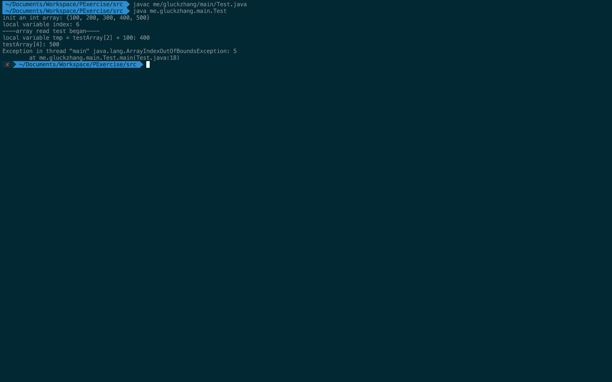
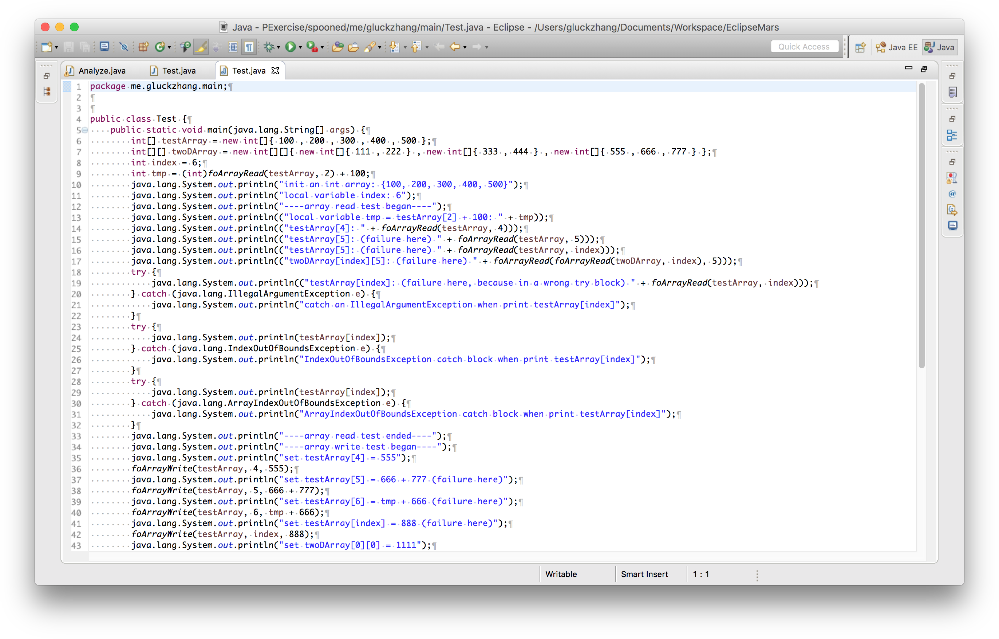
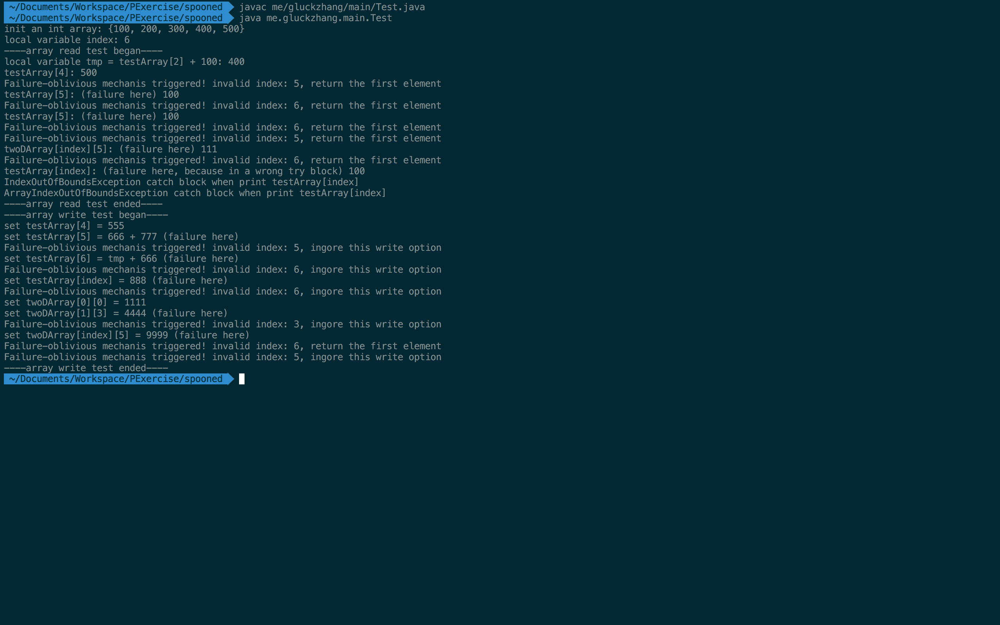

# foPreprocessor
This is a failure-oblivious prototype for Java, which handles ArrayIndexOutOfBoundsException, as described in the paper ["Enhancing server availability and security through failure oblivious computing"](https://www.google.com.hk/url?sa=t&rct=j&q=&esrc=s&source=web&cd=1&cad=rja&uact=8&ved=0ahUKEwiqmrzD_PvVAhUEf7wKHQK0CgMQFggkMAA&url=%68%74%74%70%73%3a%2f%2f%70%65%6f%70%6c%65%2e%63%73%61%69%6c%2e%6d%69%74%2e%65%64%75%2f%72%69%6e%61%72%64%2f%70%61%70%65%72%2f%6f%73%64%69%30%34%2e%70%64%66&usg=AFQjCNHb63_6oMCpTUpRghm_6ZWWTg7pYQ).

The author of the paper implemented a safe compiler for C, and discussed the mechanism of failure-oblivious computing. I only prototyped a proof-of-concept implementation, lots of work still remain to be done. So I call it a preprocessor, after foPreprocessor handleds the array read or wirte blocks, we can use javac to compile the files again.

# Project Info
This is an Eclipse project, you can import and run it in your Eclipse. Or directly read my screenshots as follows. I used Spoon to transform java codes in this project, you can see Spoon's introduction as follows.

#Simplifying Assumptions
This prototype only handles one-dimensional array reading or writing operations.

# How to Achieve This Prototype


# Testing Results


I wrote a test file called Test.java, which included some array read and array write operations. Some of them will lead to a failure because of invalid index values.



Directly compile the Test.java, you will see a failure like this.


So we use foPreprocessor to handle this file, through the log, you can see that some codes have been transformed into failure-oblivious style.



Test.java has been transformed.



After the pre-processing, we can compile the spooned Test.java again, and you will find that it can successfully run to the end!

# About Spoon

Spoon is an open-source library to analyze, rewrite, transform, transpile Java source code. It parses source files to build a well-designed AST with powerful analysis and transformation API. It fully supports Java 8.
External contributions as pull requests are welcome.
The official website is available at <http://spoon.gforge.inria.fr/>.
Spoon is an official Inria open-source project, and member of the [OW2](https://www.ow2.org/) open-source consortium.

- If you use Spoon for industrial purposes, please consider funding Spoon through a research contract with Inria (contact [Martin Monperrus](http://monperrus.net/martin/) for this).

- If you use Spoon for academic purposes, please cite: Renaud Pawlak, Martin Monperrus, Nicolas Petitprez, Carlos Noguera, Lionel Seinturier. “[Spoon: A Library for Implementing Analyses and Transformations of Java Source Code](https://hal.archives-ouvertes.fr/hal-01078532/document)”. In Software: Practice and Experience, Wiley-Blackwell, 2015. Doi: 10.1002/spe.2346.

```
@article{pawlak:hal-01169705,
  TITLE = {{Spoon: A Library for Implementing Analyses and Transformations of Java Source Code}},
  AUTHOR = {Pawlak, Renaud and Monperrus, Martin and Petitprez, Nicolas and Noguera, Carlos and Seinturier, Lionel},
  JOURNAL = {{Software: Practice and Experience}},
  PUBLISHER = {{Wiley-Blackwell}},
  PAGES = {1155-1179},
  VOLUME = {46},
  URL = {https://hal.archives-ouvertes.fr/hal-01078532/document},
  YEAR = {2015},
  doi = {10.1002/spe.2346},
}
